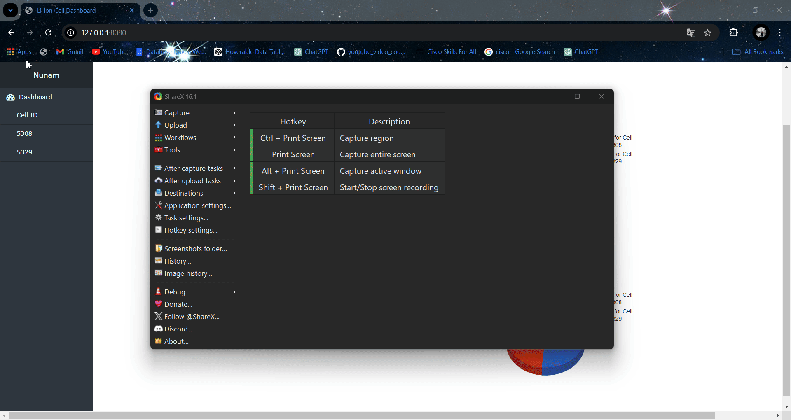

# Nunam Assignment

This repository contains the code for a Flask-based web application that visualizes cell data. The application includes dynamic charts for various cell parameters.

## Table of Contents

- [Installation](#installation)
- [Usage](#usage)
- [API Endpoints](#api-endpoints)


### Steps

1. **Clone the repository**:

    ```bash
    git clone https://github.com/kvtharunkumar/Nunam_Assignment.git
    cd Nunam_Assignment
    ```


2. **Install the dependencies**:

    ```bash
    pip install -r requirements.txt
    ```

2. **Set up the database**:

    - Create a database in MySQL.
    - Update the database configuration in `database.py and app.py`:

        ```python
        DB_HOST = 'your_database_host'
        DB_USER = 'your_database_user'
        DB_PASSWORD = 'your_database_password'
        DB_NAME = 'your_database_name'
        ```

        ```

5. **Run the Flask application**:

    ```bash
    flask run
    ```

6. **Navigate to the application in your browser**:

    ```bash
    http://127.0.0.1:8080
    ```

## Usage

- The main page displays buttons in the navigation bar. Click on a cell ID button to view detailed charts for that cell.
- The charts include Voltage vs Time, Current vs Time, Capacity vs Time, and Temperature vs Time.

## API Endpoints

- **GET /api/cell_data/<cell_id>**: Retrieves the data for the specified cell ID.

- **GET /api/soh/<cell_id>**: Retrieves the soh data for the specified cell ID.
    ```


## Project Demonstration




